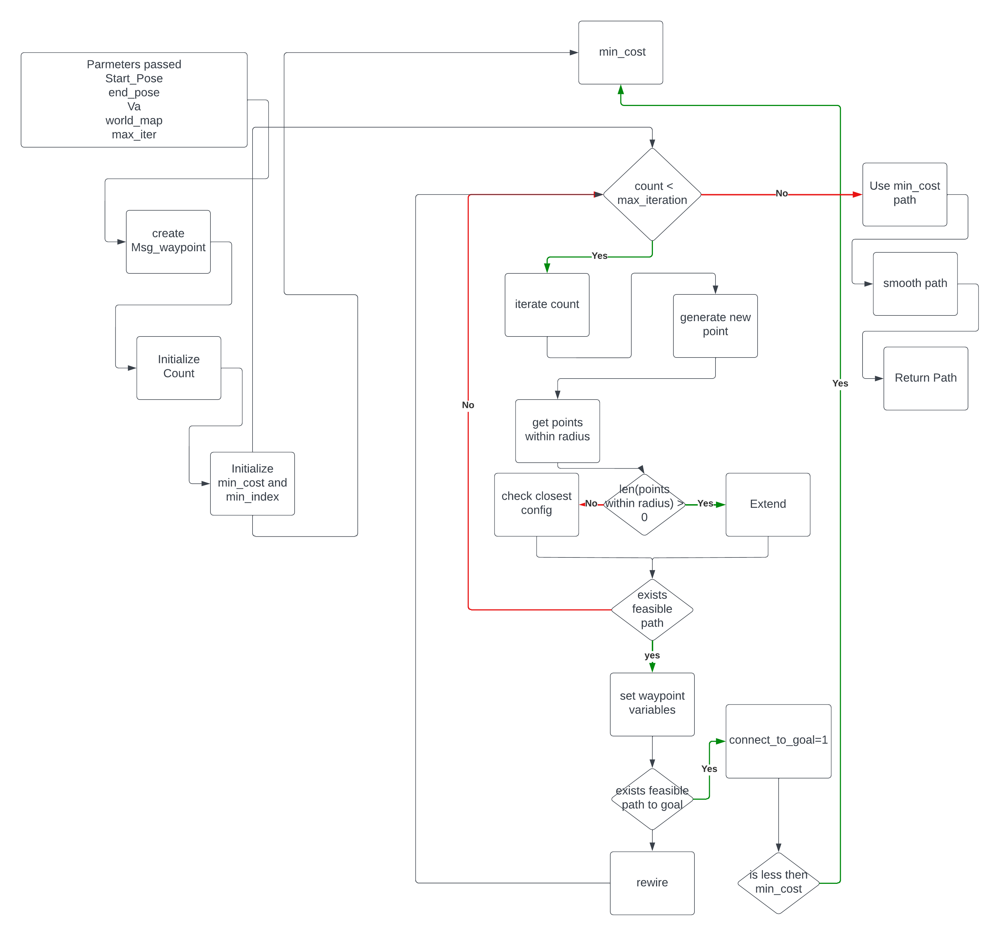
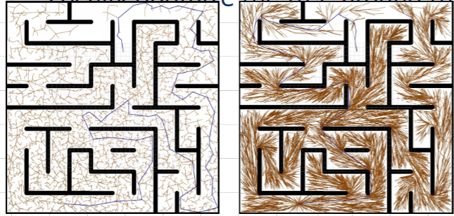
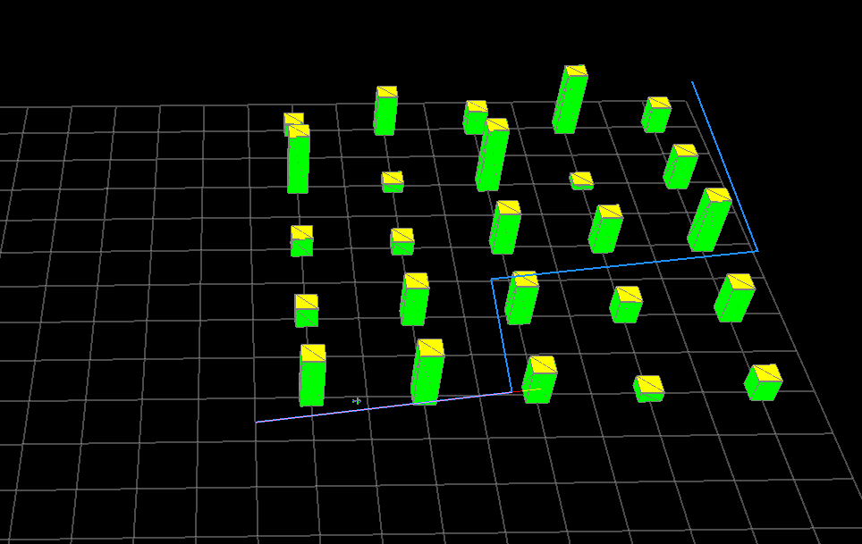
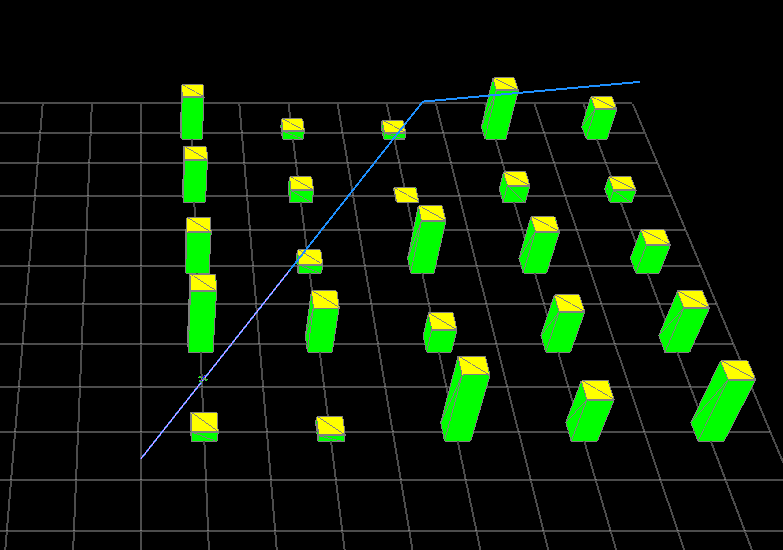
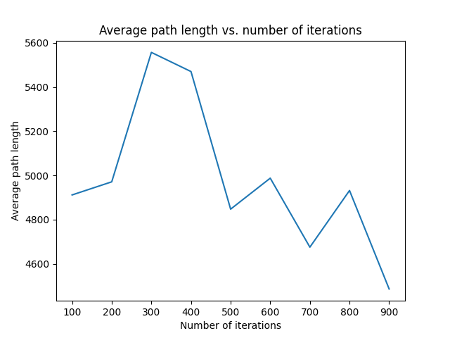

# UAV_RRT_Star_Planner

## Project Description

This project is extending on work from the USU ECE 5330 class to create an RRT\* planner.
The primary goal of RRT\* is to
provide better heuristics for connecting new nodes to graphs
that are not greedy in nature, unlike traditional RRT. These
improved connection heuristics allow RRT\* to converge on
true optimality as time goes to infinity, whereas traditional
RRT does not provide such a guarantee. The implementation
of Straight Line RRT can cause winding paths that can never
converge on the optimal solution. Modifying the Straight Line
RRT algorithm is beneficial for UAV planning. The main
benefit is that the paths produced by the RRT* planner provide
straighter and more energy efficient paths that are easier to
follow. This allows a given UAV to traverse more ground and
waste less energy traversing a specified area.

## Running RRT \* Planner in Python

To run the code in python, the package must first be installed. This can be done by running the following commands in the terminal:

```
cd src/mavsim_python
pip3 install -e .
```

After the package is installed, the planner can be run by running the following command in the terminal:

```
python3 mav_sim/final_project/run_final_project.py
```

## Running RRT \* Planner in ROS

After the python package is installed, verify that you have ROS2 Humble Haskell installed. If you do not have ROS2 installed, follow the instructions on the ROS2 website to install it. After ROS2 is installed, the package can be built by running the following commands in the terminal:

```
cd ../..
colcon build
source install/setup.bash
ros2 launch uav_launch final_path_planner.launch.py
```

## Project Details

There are two primary modifications in RRT* compared to
traditional RRT.

### Extend Algorithm

The first change involves the addition of a randomly con-
figured point to the existing tree. In traditional RRT, a point is
randomly selected and placed into the graph by selecting the
node with the shortest distance to the randomly placed point.
In RRT*, the point is connected to the node which minimizes
the overall cost to reach the new node located at the randomly
placed point within a pre-determined radius.

### Rewire Algorithm

The second modification comes after the new point has been
added to the graph. With the radius defined within the extended
algorithm, this new algorithm looks at each node within this
radius and determines whether the cost would be minimized
by making the parent of that node the new node added in
the extended algorithm. After a given node is rewired, it must
update the costs of all its children

## Algorithm Code Diagram



## Expected and Actual Results

The anticipated outcome of utilizing the RRT* algorithm
is expected to generate straighter paths, as opposed to the
convoluted ones that the conventional RRT algorithm tends to
produce. This phenomenon is attributed to the rewire process
which enables paths to become straighter by establishing the
minimum cost of a path as a straight line to the present po-
sition. These expected differences are demonstrated in the figure below.



The first figure below shows the results
of my already implemented straight-line RRT planner. It can be observed that the planner has a sub-optimal path the several bends in the path instead of driving directly to the goal. The scond figure shows the results from the RRT* planner. The difference in optimally
can be observed by how few turns the planner has to take. The
rewire heuristic allows the UAV to drive directly to the goal
with a single turn. With these results, the expected outcome it can be vallidated that the expected results were achived.




# Videos of Planner in Action

## Python Visualization

[](https://www.youtube.com/watch?v=ccXIsaPB2xI)

## ROS Visualization


<!-- blank line -->
[](https://www.youtube.com/watch?v=DpdBQXtxwYk)

## Verification of convergence to optimal solution

The following figure shows the average path length given a number of iterations. It can be observed that the path length converges to the optimal solution as the number of iterations increases.

